# Aspnet
## Auth
use the console to generate the bearer token via the dotnet command
`dotnet user-jwts create`

### ValidIssuer
Configuring the `ValidIssuer` property in the `Authentication` property of the launchsettings to `dotnet-user-jwts` will recognize these tokens generated from the command line to be valid
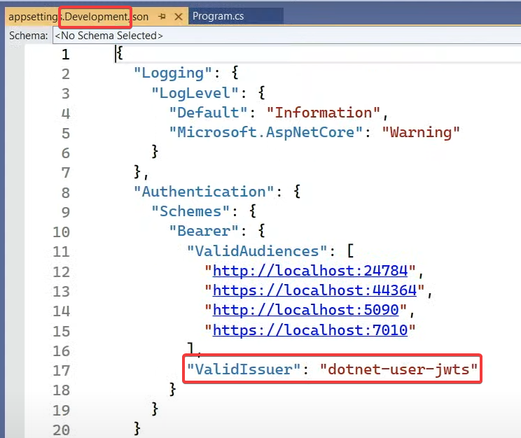

## Devtunnels
Configuration settings on the csproj which will generate a public url which points to your own machine 

## Request
### MapRoute
`MapRoute`
Configure a prefix to the routes for a certain model
It is possible to chain `MapGroup` calls to apply rules like logging to all requests and then a subset of request for specific rules

#### Scaffold the routes
Use visual studio to scaffold the routes in the same way a standard controller works

## Response
`TypedResults` is for swagger metadata
`Task<Results<Ok<Model>, NotFound>>` can be configured on the endpoint itself which is also for metadata in swagger so swagger is aware what the possible result types are

## Http/3
Is now officially supported, it is still opt-in and should be configured in the kestrel configuration

### WebTransport
WebTransport is now in the experimental phase
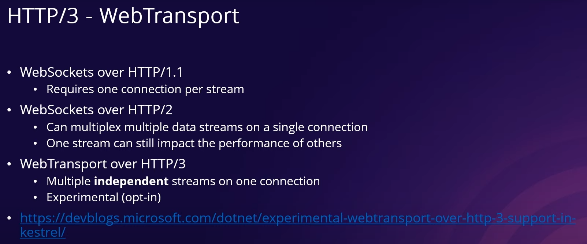

## Rate limiting
`AddRateLimiter` can be used to now configure a rate limiting.

### Fixed Time Window
Based on time, e.g. twice per hour, but the hour starts counting when you first send a request
Think of 1:23 PM you send 2 requests, it resets 2:23 PM

### Sliding Time Window
Based on static time, e.g. twice per hour, but the hour is statically defined to be reset every hour.
Think of the reset timer being based on clock hours, in this case it resets 1 PM and 2 PM etc.
In this case you can send 2 requests at 1:55 PM. At 2 PM it resets and you can resend 2 requests

### Concurrency limit
Only allow 10 concurrent requests for any user.
Multiple users will consume these requests and the 11 user will be denied.

### Token Bucket Limit
Every request takes a bucket which will be replenished at a fixed time.
Think of the following: every 2 minute return 5 tokens to the bucket.
Even when the requests are still running there will be 5 new tokens available.
The tokens cannot exceed a predefined bucket limit

### Partitions
Define a limit by a custom value, e.g.
1. Based in IP
2. Based on Token

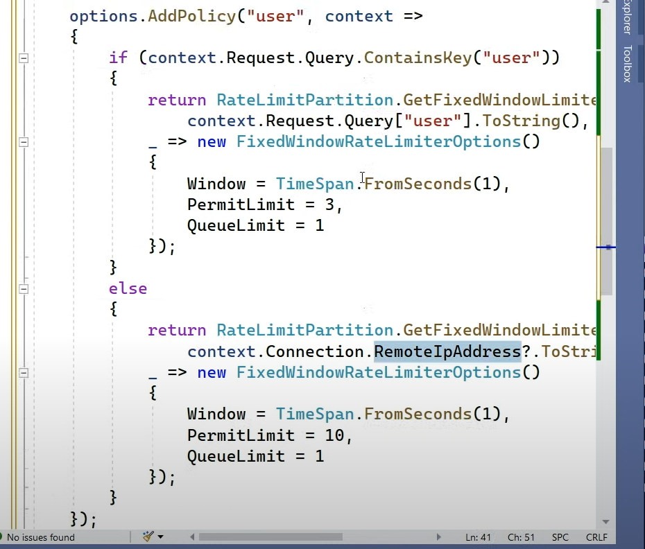

## Output Caching
This will cache the result of the api and will respond to future requests with a cached response

### Work With Rate Limiting
Order is important when calling the `UseOutputCache` and `UseRateLimiter` methods.
When you call `UseOutputCache` first it will not use `Rate Limiting`.
When calling the `UseOutputCache` after the `UseRateLimiter` call it will both cache and respect the rate limiting configured

# Docker
## Chiseled 
104 MB image size

# Blazor
## Custom Component
Integrate an blazor component with other code stacks that are hosted on the same domain
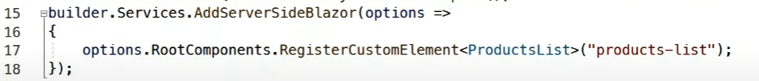
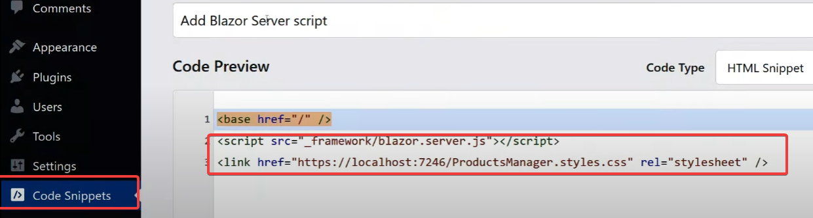
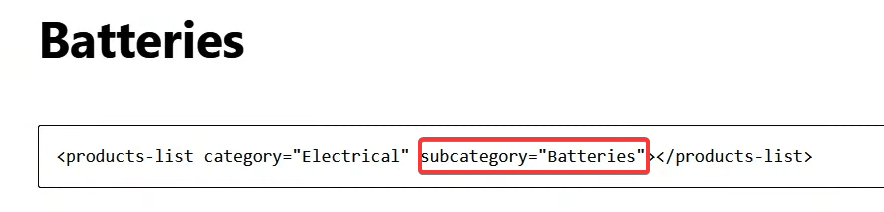

The image above not only shows how to reference the custom blazor component but also configures parameters which are sent to the blazor component

## Progress Bar
It is now possible to configure a progress bar on the blazor site when the site is being loaded. Using an existing template will automatically configure this for you,
but it is also possible to manually create this progress bar with manual UI components and CSS.
Using the following variable in CSS which is build in, you can get the current state of the loading in procentage.
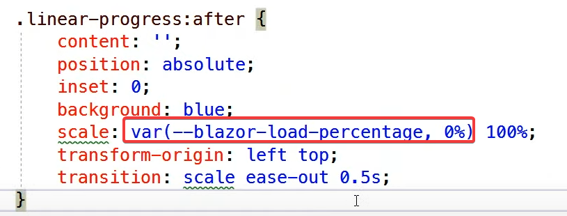

## WebAssembly
### SIMD / Vectorization
WebAssembly now supports SIMD via the already existing apis

### Multithreading [ALPHA]
Not supported out of the box, but can be configured to be used. **NOT PRODUCTION READY**

# Azure
## Container Apps
Azure Container apps are container images running in a cluster. These containers are running on Kubernetes in the background, but do not require Kubernetes configuration.

### Possibilities
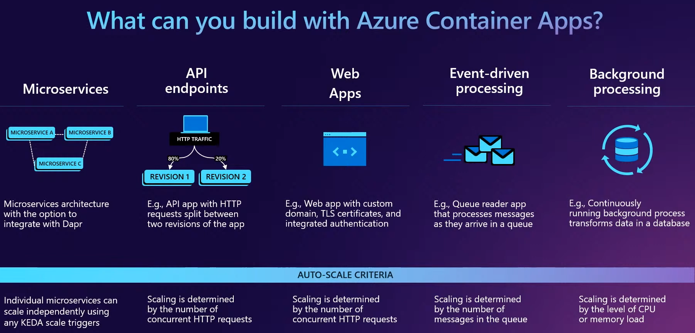
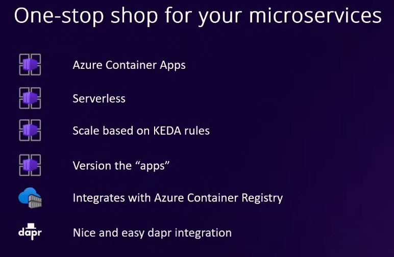

### Ingress
Configuring Ingress:
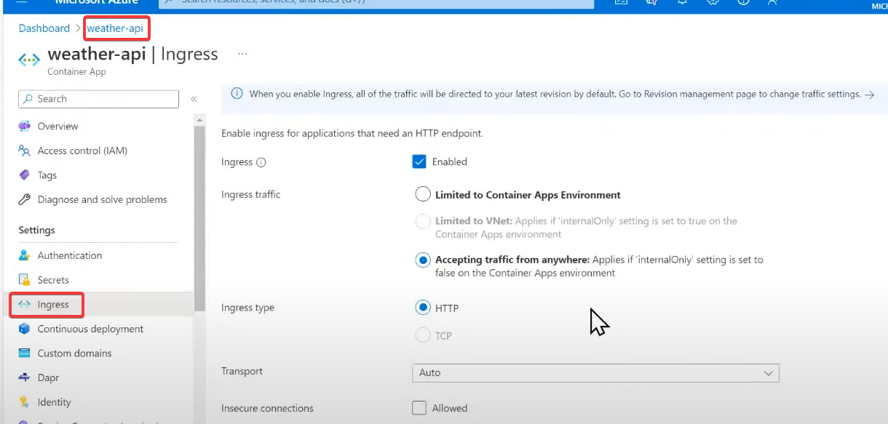

### Dapr
Enabling Dapr requires a in Azure Configuration:
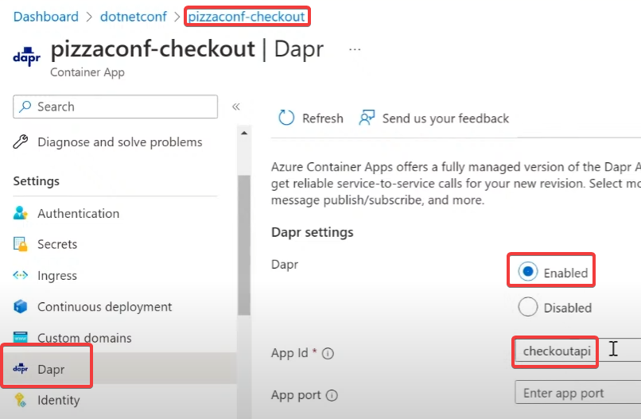
Using Dapr requires a request header to be set:
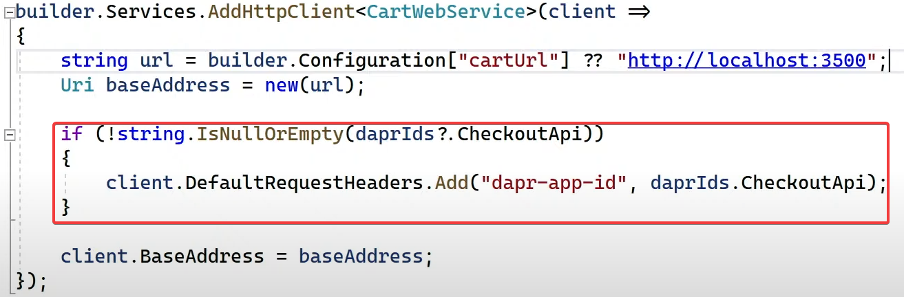
Dapr also integrates with Application Insights which will automatically collect logs and traces.

### Container Apps vs Azure Kubernetes Service
Container apps runs on top of Kubernetes, but provides a bunch of abstractions so you as a developer don't have to worry about the infrastructure yourself.
You still get alot of capabilties of running your app in Kubernetes.

#### Rule of Thumb
If you don't wanna manage the infrastructure, you can start with Container Apps.
When you later on need to have more control you can easily switch to Kubernetes as the things that Container Apps support like Dapr, Ingress, etc.
are all supported in Kubernetes.
Moving from Kubernetes to Container Apps for the other way around is also possible.

## CDN for Blob Storage
It is possible to create a CDN for the Blob Storage which will serve all the files within the Blob Storage via the Azure CDN

## App Configuration
Using `Microsoft.Azure.AppConfig` nuget package will allow the usage of the `App Configuration` for this app.
`DefaultAzureCredential` will be resolved in two different ways:
1. When running locally, it will use the currently logged in Visual Studio user account
2. When deployed to the Cloud, it will use the managed identity configured for that app.
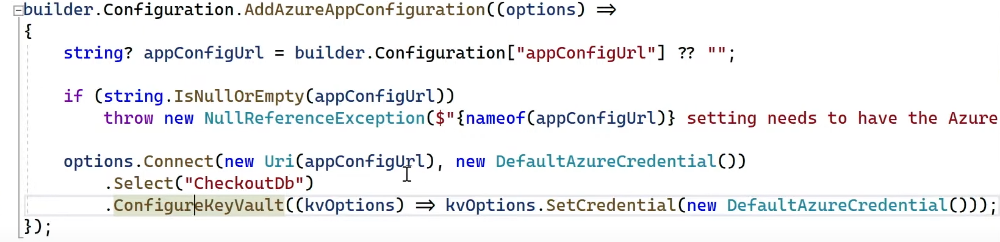

## Azure Functions
Isolated process is now completely decoupled from the host and will from now on allow any runtime version as long as Azure supports it.
Middleware is now also supported

# MAUI
## Blazor Hybrid
Shell can be used to add native navigation based on the environment your app is currently running on.
[AirQualityApp](https://github.com/jamesmontemagno/Airqualityapps)

# Orleans
Framework for `horizontally` scaling your ASP.NET Core application.
Orleans hides the service discovery when calling endpoints on other services. 
Think about calling an object which lives in an application behind a load balancer, orleans will contact the right application for you and return the response.
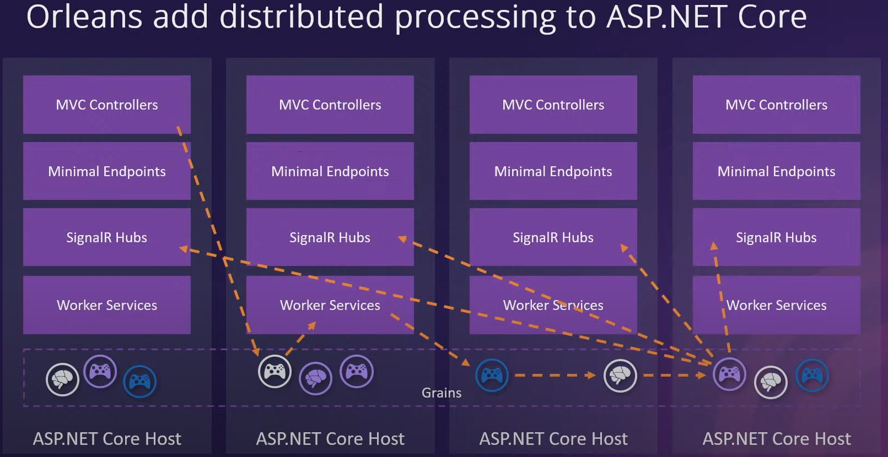
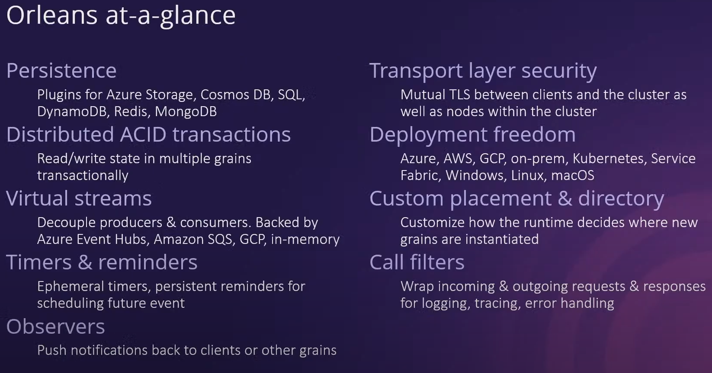
