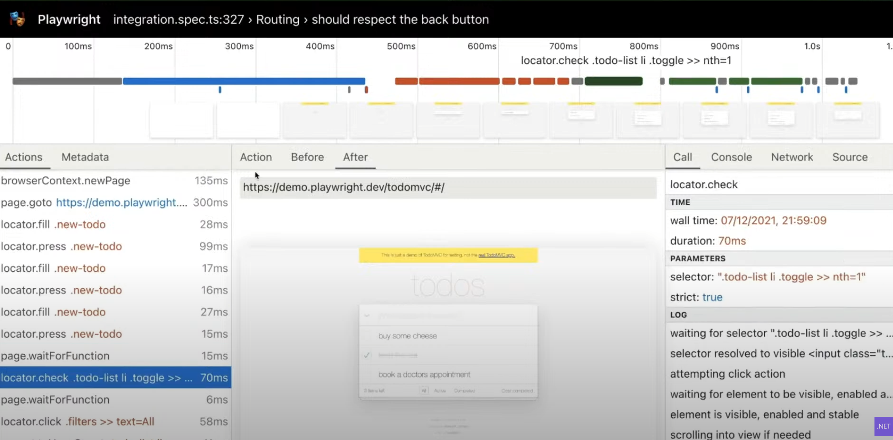

# Aspnet
## Auth
use the console to generate the bearer token via the dotnet command
`dotnet user-jwts create`

### ValidIssuer
Configuring the `ValidIssuer` property in the `Authentication` property of the launchsettings to `dotnet-user-jwts` will recognize these tokens generated from the command line to be valid

## Devtunnels
Configuration settings on the csproj which will generate a public url which points to your own machine 

## Request
### MapRoute
`MapRoute`
Configure a prefix to the routes for a certain model
It is possible to chain `MapGroup` calls to apply rules like logging to all requests and then a subset of request for specific rules

#### Scaffold the routes
Use visual studio to scaffold the routes in the same way a standard controller works

## Response
`TypedResults` is for swagger metadata
`Task<Results<Ok<Model>, NotFound>>` can be configured on the endpoint itself which is also for metadata in swagger so swagger is aware what the possible result types are

## Http/3
Is now officially supported, it is still opt-in and should be configured in the kestrel configuration

### WebTransport
WebTransport is now in the experimental phase

## Rate limiting
`AddRateLimiter` can be used to now configure a rate limiting.

### Fixed Time Window
Based on time, e.g. twice per hour, but the hour starts counting when you first send a request
Think of 1:23 PM you send 2 requests, it resets 2:23 PM

### Sliding Time Window
Based on static time, e.g. twice per hour, but the hour is statically defined to be reset every hour.
Think of the reset timer being based on clock hours, in this case it resets 1 PM and 2 PM etc.
In this case you can send 2 requests at 1:55 PM. At 2 PM it resets and you can resend 2 requests

### Concurrency limit
Only allow 10 concurrent requests for any user.
Multiple users will consume these requests and the 11 user will be denied.

### Token Bucket Limit
Every request takes a bucket which will be replenished at a fixed time.
Think of the following: every 2 minute return 5 tokens to the bucket.
Even when the requests are still running there will be 5 new tokens available.
The tokens cannot exceed a predefined bucket limit

### Partitions
Define a limit by a custom value, e.g.
1. Based in IP
2. Based on Token

## Output Caching
This will cache the result of the api and will respond to future requests with a cached response

### Work With Rate Limiting
Order is important when calling the `UseOutputCache` and `UseRateLimiter` methods.
When you call `UseOutputCache` first it will not use `Rate Limiting`.
When calling the `UseOutputCache` after the `UseRateLimiter` call it will both cache and respect the rate limiting configured

# Docker
## Chiseled 
104 MB image size

# Blazor
## Custom Component
Integrate an blazor component with other code stacks that are hosted on the same domain

The image above not only shows how to reference the custom blazor component but also configures parameters which are sent to the blazor component

## Progress Bar
It is now possible to configure a progress bar on the blazor site when the site is being loaded. Using an existing template will automatically configure this for you,
but it is also possible to manually create this progress bar with manual UI components and CSS.
Using the following variable in CSS which is build in, you can get the current state of the loading in procentage.

## WebAssembly
### SIMD / Vectorization
WebAssembly now supports SIMD via the already existing apis

### Multithreading [ALPHA]
Not supported out of the box, but can be configured to be used. **NOT PRODUCTION READY**

### AOT Compilation
Compiling your webassembly app in AOT improves the performance of the app by alot!

## Playwright Testing
Playwright is a testing framework for UI testing. It is possible to record UI steps like clicking buttons which will automatically generate test code which can be automated.

### Tracing
It is possible to look through traces made by playwright in which you can see the following information:
1. The steps which got executed
2. How long these steps took to execute
3. The devtools of your browser at that point (think about console errors)
4. A snapshot of your website at that time, so you can see what went wrong in the UI.

By default Playwright creates a browser in background to perform tests, it is possible to configure that the browser should be visually launched.

### Integration with MSTest
It is possible to create unit tests with the playwright.
Using `await Page.PauseAsync()` in the test will pause the execution to allow you as the developer to debug in the browser for issues.

### Recording Playwright Steps

## Styling
### Sass
It is possible to compile sass files for Blazor projects right from the csproj file in your MSBuild commands.

### CSS
#### CSS Isolation
It is possible to create a CSS file which would only be applied to that single component. These CSS files are linked to the corresponding razor component based on the name with a suffix of `.css`
e.g. `Counter.razor` would have an isolated css file named `Counter.razor.css`.
The compiler will scope the css to only the html in the razor file based on an unique identifier generated at compile time.

#### CSS Variables
Creating variables is possible by using a prefix of `--` with an name of the variable and the value e.g. `--foo: #000;`. 
This will create a variable named `--foo` and can later on be referenced using the `var` keyword e.g. `var(--foo, [fallback value])`
It is also possible to define a scope in which this variable is set to a specific value:
1. using `:root { --foo: #000; }` will globally set the variable `--foo` to `#000`
2. using `.baz { --foo: #FFF; }` will set the variable of `--foo` to `#FFF` **ONLY** when it is applied on the baz class.

# Azure
## Container Apps
Azure Container apps are container images running in a cluster. These containers are running on Kubernetes in the background, but do not require Kubernetes configuration.

### Possibilities

### Ingress
Configuring Ingress:

### Dapr
Enabling Dapr requires a in Azure Configuration:

Using Dapr requires a request header to be set:

Dapr also integrates with Application Insights which will automatically collect logs and traces.

### Container Apps vs Azure Kubernetes Service
Container apps runs on top of Kubernetes, but provides a bunch of abstractions so you as a developer don't have to worry about the infrastructure yourself.
You still get alot of capabilties of running your app in Kubernetes.

#### Rule of Thumb
If you don't wanna manage the infrastructure, you can start with Container Apps.
When you later on need to have more control you can easily switch to Kubernetes as the things that Container Apps support like Dapr, Ingress, etc.
are all supported in Kubernetes.
Moving from Kubernetes to Container Apps for the other way around is also possible.

## CDN for Blob Storage
It is possible to create a CDN for the Blob Storage which will serve all the files within the Blob Storage via the Azure CDN

## App Configuration
Using `Microsoft.Azure.AppConfig` nuget package will allow the usage of the `App Configuration` for this app.
`DefaultAzureCredential` will be resolved in two different ways:
1. When running locally, it will use the currently logged in Visual Studio user account
2. When deployed to the Cloud, it will use the managed identity configured for that app.

## Azure Functions
Isolated process is now completely decoupled from the host and will from now on allow any runtime version as long as Azure supports it.
Middleware is now also supported

# MAUI
## Blazor Hybrid
Shell can be used to add native navigation based on the environment your app is currently running on.
[AirQualityApp](https://github.com/jamesmontemagno/Airqualityapps)

# Orleans
Framework for `horizontally` scaling your ASP.NET Core application.
Orleans hides the service discovery when calling endpoints on other services. 
Think about calling an object which lives in an application behind a load balancer, orleans will contact the right application for you and return the response.

# C#
## Required Properties
Init only properties now support the `required` keyword which will enforce the user to set the value of the property through the object initializer.
Can even be used on properties of an `Attribute`.
Required is inherited by default and is still required on child classes.
It is possible to ignore `required` properties **ONLY** when setting a `SetsRequiredAttribute` on a constructor which then will fill in all the required properties.

## Static Abstract Members on Interfaces
`static abstract` members enforce the implementors of the interface to implement this static member in their own way.
This can even be done on operators like the `+` operator. Great example of this use case is the `IAdditionOperators` interface which enforces the `+` operator on any number (double, int, etc.)
Overloading a checked version of your operator is supported by simply adding the `checked` keyword to your method signature.

## Performance
Detailed blog about all the improvements can be found here:
[.NET 7 Improvements](https://devblogs.microsoft.com/dotnet/performance_improvements_in_net_7/)

### On-Stack Replacement (OSR)
Loop iterations are now tracked for the tiered compilation, this is on by default.
This means that loops which previously did not get any tiered compilation to improve the throughput will now on the fly improve the method code when the Jitter hits the compilation tier threshhold.

## File Scoped Classes
Mostly used for source generators to ensure there is no way that files have conflicting names when generating a backing class.
The `file` keyword results in the class only being available within that file.

# Github
## Dependabot
Using dependabot can create PR's for updating nuget package changes which will include the changelogs, commits, and release notes of all the newer versions of your nuget package.
Dependabot can also create warnings for security vulnerabilities, which will be created as security advisories in github.

## Codespaces
Everybody gets 60 minutes of codespaces for free per month!

# Microsoft Devbox
It is possible to create a dev box setup by your IT department for specific needs and projects.
Before creating a dev box you need to select a project and dev box pool out of the projects and hardware pools setup.

This dev box will have everything needed for your project ready. Think of the following:
1. Frontend dev pool -> Visual Studio Code, npm, etc.
2. Backend dev pool -> Visual Studio, dotnet, etc.
3. etc.

## Auto Stop Time
Dev box pools can be set to have an auto stop time which will automatically shut down an idle dev box,
when the dev box is still being used the user will receive a notification about the shut down and can delay the shut down timer so the developer can continue working.

## Github Integration
It is possible to create a dev box from github actions to easily review your changes on the fly.

# Low Code
Below is a rule of thumb which will guide when to use low code and when not to use low code:

## Architecture
As Power Apps or other kinds of low-code applications don't have code to execute the business logic it is recommended to create custom connectors behind the low-code applications.

The image above shows how to use the low-code for the frontend but execute the business logic behind the frontend in a Rest API (can be .NET).
This way can even leverage from a microservices architecture in which you run the backend business logic as microservices.

# WinUI 3
It is possible to create custom widgets for windows.
Supports .NET 7 with C# 11.
It is part of a nuget package, so you as the developer will decide when to update.

## Dark / Light Mode
Adding a new item via the `New Item (Template Studio)` option and selecting the `Settings` Page will automatically add a settings page navigation cockwheel.
The settings page automatically adds `Dark` and `Light` theme settings. These settings will work any native components which have not been set to a color manually.

## Rive Animations
Rive Animations are awesome! The animations have properties which will show different animations based on these property values.

# CoreWCF
Possibility to create a WCF Server and Client in .NET 7
Deployment of WCF is moved to ASP.NET Core, it is implemented as a middleware and will therefore support all the same features as ASP.NET Core does.

## Dependency Injection
CoreWCF allows your connected WCF service to be injected via dependency injection, this in turn will allow other services to be injected as dependency injected services into the connected WCF service.
Example of this would be to inject the `ILogger` class into the connected WCF service so you can use this logger to log endpoint information.

### Injected Attribute
It is possible to get the `HttpContext` or any other DI type when the method gets called.
There are 3 steps to enable this feature:
1. Add a package reference to `CoreWCF.Primitives`
2. Change the `Service` class to `partial`, this is done as the parameters do not match the interface signature and the `partial` keyword will allow code generation to create the method which matches the interface and internally call your method with the requested parameters
3. Add the `Injected` attribute to the `parameter` which you want to be injected.

## Features

## Upgrade Assistant
Upgrading WCF to CoreWCF is now supported as part of the upgrade assistant.

# gRPC
## Server Reflection
With gRPC server reflection you can expose metadata about your gRPC contracts that are being hosted. You no longer have to share the `proto` file manually to every client when using `gRPC Server Reflection`.

### Enabling Server Reflection
There are a couple of steps you need to take before server reflection is enabled on your gRPC server:
1. Add the `Grpc.AspNetCore.Server.Reflection` nuget package to your server project.
2. Add the `AddGrpcReflection` method to your services.
3. Map the `MapGrpcReflectionService` method to your app.

## Postman
Postman now supports gRPC Requests! Using [Server Reflection](#server-reflection) allows you to retrieve the metadata from your gRPC server in Postman and from there on get the endpoints.

## gRPC Json Transcoding
With Json Transcoding it is possible to expose the gRPC methods via gRPC as well as classic REST.
The following steps enable the Json Transcoding feature:
1. Add the `Microsoft.AspNetCore.Grpc.JsonTranscoding` nuget package to your server project.
2. Add `AddJsonTranscoding` method to your `AddGrpc` method chain.
3. Configure the endpoint route and type of your gRPC method on REST

Notice that the `Name` property directly links to the `Name` property of the input type (`HelloRequest`)

### Swagger
Because Rest api's show up in swagger it is now possible to add swagger for your Rest api's.
The following steps enable swagger for the Json Transcoded methods:
1. Add the `Microsoft.AspNetCore.Grpc.Swagger` nuget package to your server project.
2. Add the `AddGrpcSwagger` method to your services.
3. Add the default `AddSwaggerUI` and `UseSwaggerUI` methods.

## Azure App Service
gRPC is now supported on Azure App Service.
This is done by replacing the existing proxy with a YARP proxy that supports gRPC out of the box (built on dotnet).

# NativeAOT
Compiling C# to an AOT exe will lose features like dynamic code e.g. Reflection or Assembly loading.
It will however have a lower memory usage, faster startup time, and better native interopability

Information is interesting, but to hard to explain.
Full video can be found here: [Video TODO](youtube.com/)
Session: 

# Microservices
## Authentication / Authorization

Very interesting, but to hard to explain.
Full video can be found here: [Video TODO](youtube.com/)
Session: 

### Important Reminders
#### Authorization Response
It is smart to return the permissions for the items available to the current user when returning the items you want to show.

#### Conclusion

#### Resources
[Authorization in a microservices world](https://www.alexanderlolis.com/authorization-in-a-microservices-world)

# Polyglot Notebooks
Uses `.NET Interactive` as engine to run multiple different languages in the same interactive notebook.

## Input
It is possible to ask the user for input using the `@input:[store location]`. Store location is the location in which the data will be stored, kind of like a variable.
In the Visual Studio Code extension you can open the values of the Polyglot notebook and where the values are currently stored

## Nuget packages
Possible to use nuget packages, you need to install them first using the `#r "nuget: [package name]"` command.

## UI
Possible to show collections in a table like manner. To do this you need to create a command which ends with a collection and uses (for C#) `.ToTabularDataResource().Display();`

## Github
Visualization for Interactive notebooks has been updated and are now supported on Github.
It does not support scrolling when you have not outlined your code well enough

## Dynamically Create Notebook Commands
It is possible to use the kernel and generate new notebook commands while executing a command.
The gif below generates a new `pie` command when running the `C#` command

# TODO
Missed sessions:
## First Missed Sessions Chain
Starting from:

Until:

## Second Missed Sessions Chain
Starting from:

Until:
...
## OSS Spotlights
OSS Spotlights where not shown on the main livestream and are therefore missed

