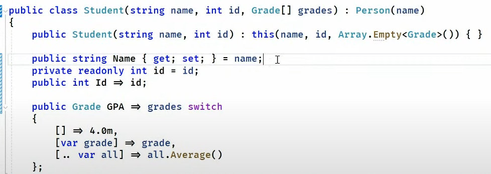

- [Asp.Net](#aspnet)
  - [Blazor](#blazor)
    - [Stream rendering](#stream-rendering)
    - [Static Server Side Rendering](#static-server-side-rendering)
    - [Enhanced navigation](#enhanced-navigation)
    - [Rendering mode](#rendering-mode)
- [Containers](#containers)
  - [Base image](#base-image)
- [.NET Aspire](#net-aspire)
  - [Deployment](#deployment)
- [Performance](#performance)
  - [Asp.NET](#aspnet-1)
    - [Request delgate generator (RDG)](#request-delgate-generator-rdg)
  - [Garbage collection](#garbage-collection)
    - [Dynamically adapting to application sizes (DATAS)](#dynamically-adapting-to-application-sizes-datas)
      - [Source](#source)
  - [Dynamic profile guided optimizations (PGO)](#dynamic-profile-guided-optimizations-pgo)
  - [SearchValues](#searchvalues)
- [C# language](#c-language)
  - [Aliases](#aliases)
  - [Primary constructors](#primary-constructors)
  - [Collection builders](#collection-builders)
    - [Spread operator](#spread-operator)
- [Entity Framework](#entity-framework)
  - [Json columns](#json-columns)
  - [Array of primitives](#array-of-primitives)
  - [Parameters stored in JSON values](#parameters-stored-in-json-values)
  - [MongoDB](#mongodb)
- [AI](#ai)
  - [Semantic kernal](#semantic-kernal)


# Asp.Net
## Blazor


### Stream rendering
Stream rendering will allow a component to be set to loading which will render a temporary loading div.
After the loading is done, the component will be automatically rerendered with the new items. This can be done via adding: `@attribute [StreamRendering]` to your page. 

Using stream rendering also allows the possibility to stream updates to the frontend. This means that you could have a long running task which adds part of the page each `5` seconds. Using stream rending it is possible to do run this page/component and get the frontend to update it's data each 5 seconds based on the new content available.


Using stream rendering is useful for the following reasons:


### Static Server Side Rendering
It is now possible to do traditional SSR (server side rendering) via the new static SSR project. 

Traditional SSR:


With this new way of working it still possible to use `WebAssembly` or `Blazor Server (via websockets over SignalR)` per page or component to get the best of both worlds (in this case 3 worlds).


### Enhanced navigation
With the new enhanced navigation features in .NET 8, any page change will now by default only the dom which has changed and only request the new page data by recognizing the existing data and only request what is not yet known. This results in a SPA-like responsiveness without needing a SPA.
Also, via the `data-permanent` attribute on a form it is possible to retain data accross page navigation. Use case for this could be where you have a search bar which should retain it's search throughout all the pages. Normally when switching the page it would also lose the search data.


### Rendering mode
Using the rendering mode it is possible to specify which rendering mode should be used for the component. 

1. Choosing `Server` mode would create a websocket connection **only** for that page or component to render that component on the server. When leaving that page or component it will shut the websocket down. 
2. Choosing `WebAssembly` mode requires the component to live in the `.Client` project as everything in that project will be send to the client when working with your app.
3. Choosing `Auto` mode will run the component via `Server` mode for the first time and download the content via the `WebAssembly` on the background. The second time it requests the same page or component it will use the `WebAssembly` mode as it already has everything it needs.
   1. **Note**: this requires **both** the websocket and the component or page to be put in the `.Client` project.


# Containers
## Base image
The base image now **no** longer uses the `root user` to run the application.
This also means the base image now runs on port `8080` instead of `80`.


# .NET Aspire
Aspire.NET is an orchestrator which offers insights into other apps and provides an easy to use dashboard for looking into traces. The Aspire project is meant as a development tool and should therefore not be deployed to production itself.
.
The Aspire `AppHost` project can wire up other projects as dependencies which will create a private network in which each project can call each other under a name (like how this is done in `docker-compose`).

AppHost:


Client configuration:


## Deployment
The Aspire project is not meant to be deployed on it's own, however the Azure runtime has integrated knowledge about an Aspire project. Deploying the Aspire AppHost to Azure will run all the required dependencies via Azure `Container Apps`.

# Performance
## Asp.NET
### Request delgate generator (RDG)
Using request delegate generator will configure the app to use interceptors which will be generated at compile time via source generators to replace the **currently** only minimal api mappings like `MapPut`, `MapPost` with the optimized version which will improve the startup time for the application.


## Garbage collection
### Dynamically adapting to application sizes (DATAS)
DATAS is a new feature which enables the garbage collector to dynamically shrink the heap size depending on the load. Previously .NET always reserved a lot of memory when using the server garbage collection feature, this was in preparation to possible load it might receive. However when no such load comes it just has a lot of heap memory reserved doing nothing.

#### Source
[Medium blog explaining the details](https://maoni0.medium.com/dynamically-adapting-to-application-sizes-2d72fcb6f1ea)

## Dynamic profile guided optimizations (PGO)
On by default for .NET 8 🥳!
It will optimize it really quickly and only add the necessary intrumentation needed to keep track of the usage of the optimized code. This will allow the JITer to see patterns and optimize based on those patterns (if it considers it worthy to be optimized).

PGO can now also see and optimize based on happy flows for type hierarchy. It will look at the underlying type and if it is (almost) always the same type. It will then include the underlying type as the base call and only if it is not that type infer the actual type and call the method on that type. This reduces the need for type checking.

Setting `DOTNET_JitDisasmSummary=1` as environment variable (or by csproj config) will show the actual methods which are being compiled and when they are compiled. This also shows you the tier of which PGO the method is being compiled in.


Setting the `DOTNET_JitDisasm="[method name]"` where `[method name]` is replaced by the name of the method you want the assambly from will show you the compilation in assembly specific for the method you specified.

This also shows the tiered compilation so any recompliation will also be shown with the new assembly.


## SearchValues
Searching multiple characters inside a string via the `IndexOf` is optimized for a low amount of characters (e.g. searching for `a` or `b`), but not for an `x` amount of characters. Creating a SearchValues object with all these characters that need to be searched for will be accepted in the `IndexOf` (or others like, `LastIndexOf`) overloads and allow the `IndexOf` code to choose the most optimal way for searching based on the size of the search.


# C# language
## Aliases
Now possible to specify he primitive type instead of the fully qualified namespace for a type. Example of this would be that you could now specify:
```csharp
using Grade = decimal; // Instead of `System.Decimal`
```

It is also possible to create an alias for a pointer:
```csharp
using unsafe Grade = decimal*;
```

And even specify a `ValueTuple` as an alias including the property names which was previously not possible:
```csharp
using Grade = (string Course, decimal Value); 
```

## Primary constructors
Primary constructors is a way to define parametes on a class which will be accessible inside that class. The primary constructor removes the boiler plate code needed in your class by defining a field for the dependencies and assigning them in the constructor. Instead you only define them at the class definition and reference them inside the class (as captured context).

It is even possible to pass along the parameters to the parent class you inherit from via calling that constructor in the hierarchy definition.

As all parameters inside the primary constructor are captured context they will be considered as normal parameters instead of a field reference. This means that you can do anything you would also be able to do on a parameter (e.g. setting the value). The C# design team is thinking about a readonly annotation, but for now this can only be done by creating a custom field inside the class. When assigning it the same name, the field will get priority when being called instead of the parameter (from the captured context).




All the parametes in the primary constructor are required, so any new constructor needs to eventually call the primary constructor for that type.

## Collection builders
Starting C# 12 collections can be initialized by simply specifying the items via `[]`. The `[]` will use the `Create` method specified on the type it needs to create. For certain types like `List<T>` the compiler has deep understanding of it and it will generate the code required, but for custom collections it requires an attribute called: `CollectionBuilder`.


Usage of this collection builder will look like the following:


### Spread operator
It is possible to join a collection inside the defined collection builder via the `..` (spread operator). The compiler will find the best way to join those collections together and create a flatmapped collection.


# Entity Framework
## Json columns
EF 8 supports all the LINQ queries on an JSON field even when that field which is stored has a nested property which is a collection. It is now possible to query even the nested collections via LINQ. Projections are also supported on nested JSON properties. This uses the `WITH` (for SQL Server) keyword to create a temporary table on which it projects the JSON properties that are being used.


## Array of primitives 
Most relational databases do not natively support array as a data type. This meant that having a collection of primitives would force you to have a work around (e.g. create a collections table and reference it).

Starting EF 8 it is now possible to map have this inside the same table. If the database does not support such type EF will create a JSON field and store the data in a JSON. As EF is responsible for this field it also has in depth knowledge of the type which is useful for retrieving it as it can easily parse to the correct type and do a query on it.


## Parameters stored in JSON values
Databases typically cache execution plans for queries so when the same query is executed again it will not have to create a new execution plan.
The cached execution plan can only be used if the query is identical (execluding the parameters). When doing an `IN` operation on a collection field EF 7 added the query parameters inside the SQL query. EF 8 however puts the parameters inside an JSON array and just references the parameter inside the query. This way the database uses the native JSON operators to unpack the parameters before executing the query, however as the query is the same the database can now use the execution plan cache again!

 

## MongoDB
There is a new MongoDB provider for EF!

# AI
## Semantic kernal
AI is generally hard to configure as there are a lot of steps involved with getting the data correctly (some simple steps required):
1. Generate chunks of text for as your input tokens
2. Get the embeddings for this text
3. Vectorize these embeddings and store them in a vector db
4. Get embeddings from the input text
5. Compare the embeddings vector in the database to get simularities.

Semantic kernal helps abstract these things away and provide you an API which does this for you. This API can then talk to the configured connectors behind the scenes (like Azure OpenAI). This simplifies the process.

