- [Asp.Net](#aspnet)
  - [Middlewares](#middlewares)
    - [Antiforgery](#antiforgery)
    - [Keyed services](#keyed-services)
    - [Request timeouts](#request-timeouts)
    - [Short circuit](#short-circuit)
    - [Exception handlers](#exception-handlers)
  - [Hosted services](#hosted-services)
  - [Blazor](#blazor)
    - [Authentication and authorization](#authentication-and-authorization)
      - [Source](#source)
    - [Stream rendering](#stream-rendering)
    - [Static Server Side Rendering](#static-server-side-rendering)
    - [Enhanced navigation](#enhanced-navigation)
    - [Rendering mode](#rendering-mode)
    - [Testing](#testing)
      - [Playwright](#playwright)
      - [BUnit](#bunit)
        - [Component state](#component-state)
        - [Component markup](#component-markup)
    - [Custom elements](#custom-elements)
      - [Exporting javascript components as custom elements](#exporting-javascript-components-as-custom-elements)
    - [JavaScript projects](#javascript-projects)
    - [Sources](#sources)
- [Containers](#containers)
  - [Base image](#base-image)
  - [Chiseled image](#chiseled-image)
    - [Size difference](#size-difference)
- [.NET Aspire](#net-aspire)
  - [Deployment](#deployment)
- [Performance](#performance)
  - [Asp.NET](#aspnet-1)
    - [Request delegate generator (RDG)](#request-delegate-generator-rdg)
  - [Garbage collection](#garbage-collection)
    - [Dynamically adapting to application sizes (DATAS)](#dynamically-adapting-to-application-sizes-datas)
      - [Source](#source-1)
  - [Dynamic profile guided optimizations (PGO)](#dynamic-profile-guided-optimizations-pgo)
    - [Instrumentation overhead](#instrumentation-overhead)
    - [Guarded devirtualization (GDV)](#guarded-devirtualization-gdv)
      - [Ready to run (R2R) code PGO](#ready-to-run-r2r-code-pgo)
    - [Sources](#sources-1)
  - [SearchValues](#searchvalues)
- [C# language](#c-language)
  - [Aliases](#aliases)
  - [Primary constructors](#primary-constructors)
  - [Collection builders](#collection-builders)
    - [Spread operator](#spread-operator)
- [Entity Framework](#entity-framework)
  - [Json columns](#json-columns)
  - [Array of primitives](#array-of-primitives)
  - [Parameters stored in JSON values](#parameters-stored-in-json-values)
  - [MongoDB](#mongodb)
- [AI](#ai)
  - [Semantic kernal](#semantic-kernal)
- [OpenTelemetry](#opentelemetry)
  - [Logging](#logging)
- [Resilience](#resilience)
  - [Http client](#http-client)
- [Json](#json)
  - [Object creation handling](#object-creation-handling)
  - [Required property](#required-property)
  - [Unmapped json member handling](#unmapped-json-member-handling)
  - [Interface hierarchy](#interface-hierarchy)
- [Pattern matching](#pattern-matching)
  - [Switch expression](#switch-expression)
- [Runtime](#runtime)
  - [Native AOT (ahead of time) vs JIT (just in time) compilation](#native-aot-ahead-of-time-vs-jit-just-in-time-compilation)
    - [Advantages of AOT](#advantages-of-aot)
      - [Smaller apps](#smaller-apps)
      - [Faster startup](#faster-startup)
      - [Less memory use](#less-memory-use)
    - [How does AOT work](#how-does-aot-work)
    - [Impact of **not** having a JIT](#impact-of-not-having-a-jit)
    - [Other considerations](#other-considerations)
    - [Conclusion](#conclusion)
- [IOT](#iot)
  - [Sources](#sources-2)
- [Development tunnels](#development-tunnels)
- [.NET MAUI](#net-maui)
- [NuGet](#nuget)
  - [Auditing](#auditing)
    - [Custom vulnerability](#custom-vulnerability)
  - [Conditional package updating](#conditional-package-updating)
  - [Package source mapping](#package-source-mapping)
    - [Automatically configure the source mapping](#automatically-configure-the-source-mapping)
    - [Disallow transitive source packages from different source](#disallow-transitive-source-packages-from-different-source)
- [Clean architecture](#clean-architecture)
  - [Todo](#todo)
  - [Source](#source-2)
- [Skipping missing sessions](#skipping-missing-sessions)

# Asp.Net
## Middlewares
### Antiforgery
Anti forgery is now added as a possible middleware, this middleware is used to validate the tokens against forgery.


### Keyed services
KeyedServices allow the possibility to have multiple different services injected under the same `Interface` while being injected in another collection. This collection is named, so you can retrieve the correct variant of that interface
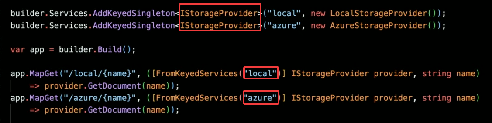

### Request timeouts
It is now possible to configure a request timeout on the server side. This means that any request that takes longer than the configured timeout will be cancelled via setting the `CancellationToken` to cancelled. If the API correctly handles this. This configuration can be done per endpoint or endpoint group as well as be set as default policy for all endpoints. Furthermore it also supports disabling it for specific endpoints.


### Short circuit
Configuring an endpoint as a short circuit endpoint will execute the api, but only do that and not add any overhead by logging the call.


### Exception handlers
Configuring exception handlers will ensure that when an exception is thrown by your application, the handler receives that exception before the connection is closed and it will decide how to handle the response.
The handler method returns `true` when it has responded to the request itself and the request has now completed and `false` when the default `UseExceptionHandler` should redirect the request to the error page.


## Hosted services
The new `IHostedLifecycleService` interface for more control over when the hosted service should run. This interface introduces the `Starting`, `Started`, `Stoping`,  and `Stopped` methods. This means the service can choose to run before the application started (e.g. when you need to migrate the database before the application can run) or choose to run a job after the application has started (e.g. just a background job that is not dependent on the application state). This improves startup time.


Also, as hosted services start in FIFO (first in first out) and stop in LIFO (last in first out) order and the startup of the application itself (`app.Run()`) is also done as an `HostedService` which is **always** appended as the last `HostedService` in the stack. It will mean that all the HostedServices have to be started before the application can be started in order. When you have HostedServices that take a while to run it will impact the whole startup time.
The reverse happens when the application stops. The application is configured (by default) to have a maximum stop time of 30 seconds which means that because the stopping is done in order and the application itself stops first. Any HostedService that takes a time chips away from this maximum stop time. This means that the last service might have only 2 seconds left to run or might not even run at all.
In .NET 8 it is possible to configuring the hosted services to be started / stopped concurrently. This can be done in the `HostOptions`.

Now possible to configure the `StartupTimeout` of the application, this will shut the application down if it does not start in the specified time.
This can be useful for situations where startup time is critical and you want to prevent regression or when some `HostedService` that is required for the app to run is actually taking up too much time which might indicate an issue.


## Blazor


### Authentication and authorization
Blazor now has a dedicated component for showing authorized views. Using the `AuthorizeView` component you can specify that a user should be **authenticated and authorized** according to the policy/role configured. This can be configured via multiple ways via the `Authorize` attribute on your component/page or via the `AuthorizeView`:


#### Source
[MSDN source](https://learn.microsoft.com/en-us/aspnet/core/blazor/security/?view=aspnetcore-8.0)

### Stream rendering
Stream rendering will allow a component to be set to loading which will render a temporary loading div.
After the loading is done, the component will be automatically rerendered with the new items. This can be done via adding: `@attribute [StreamRendering]` to your page. 

Using stream rendering also allows the possibility to stream updates to the frontend. This means that you could have a long running task which adds part of the page each `5` seconds. Using stream rending it is possible to do run this page/component and get the frontend to update it's data each 5 seconds based on the new content available.


Using stream rendering is useful for the following reasons:


### Static Server Side Rendering
It is now possible to do traditional SSR (server side rendering) via the new static SSR project. 

Traditional SSR:


With this new way of working it still possible to use `WebAssembly` or `Blazor Server (via websockets over SignalR)` per page or component to get the best of both worlds (in this case 3 worlds).


### Enhanced navigation
With the new enhanced navigation features in .NET 8, any page change will now by default only the dom which has changed and only request the new page data by recognizing the existing data and only request what is not yet known. This results in a SPA-like responsiveness without needing a SPA.
Also, via the `data-permanent` attribute on a form it is possible to retain data across page navigation. Use case for this could be where you have a search bar which should retain it's search throughout all the pages. Normally when switching the page it would also lose the search data.


### Rendering mode
Using the rendering mode it is possible to specify which rendering mode should be used for the component. 

1. Choosing `Server` mode would create a websocket connection **only** for that page or component to render that component on the server. When leaving that page or component it will shut the websocket down. 
2. Choosing `WebAssembly` mode requires the component to live in the `.Client` project as everything in that project will be send to the client when working with your app.
3. Choosing `Auto` mode will run the component via `Server` mode for the first time and download the content via the `WebAssembly` on the background. The second time it requests the same page or component it will use the `WebAssembly` mode as it already has everything it needs.
   1. **Note**: this requires **both** the websocket and the component or page to be put in the `.Client` project.


### Testing
#### Playwright
Playwright is a testing framework for Blazor frontend components. Playwright is like cypress as it runs your Blazor components inside a separately running browser process.
Using playwright you can test the frontend Blazor components. It is possible to stub/fake/mock the services that are injected via DI to ensure your tests have deterministic data on which they test.
**Note**: When running Blazor WebAssembly it is not possible to replace the services via overriding the service in DI. This is because Blazor is already compiled to WebAssembly so there is essentially no DI anymore.
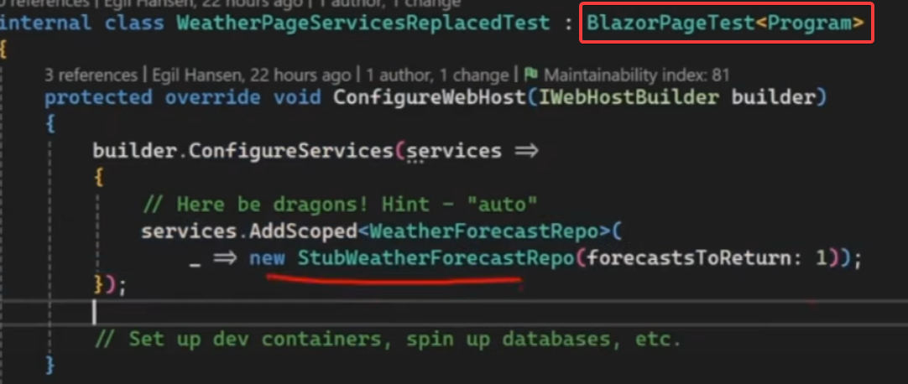
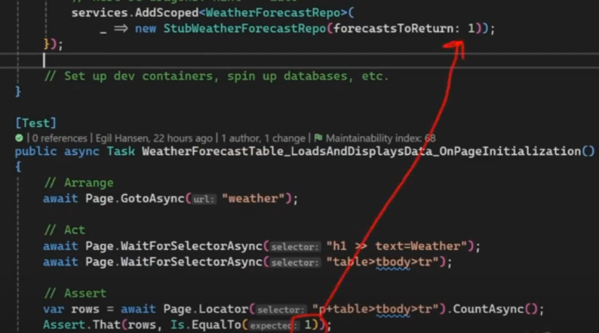

#### BUnit
Using BUnit it is possible to isolate tests specific for the component you want to test.
This framework will render a specific component with specific parameters and check the behavior of the component.
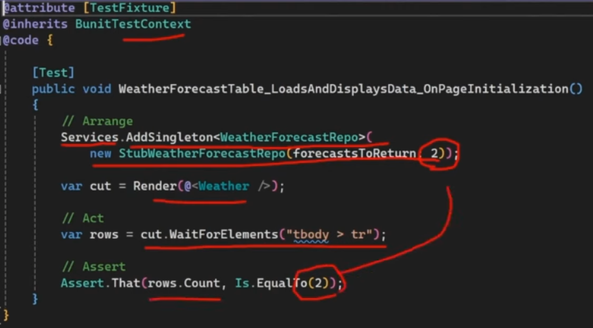

##### Component state
It is also possible to retrieve the instance of the component and verify the state of the public properties.
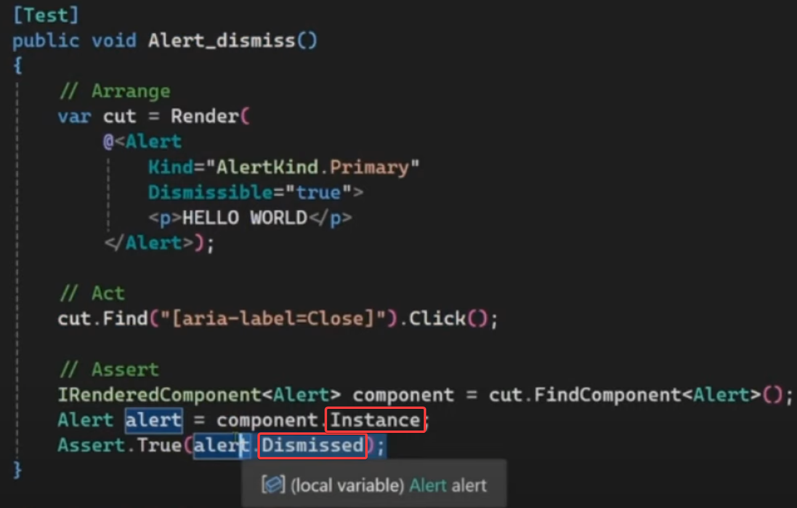

##### Component markup
BUnit also supports verifying the markup of your component. This is particularly useful when certain combinations of markup is required for a specific feature or when you dynamically set the markup based on a condition. Using the markup test will let you verify if the condition correctly sets the markup.
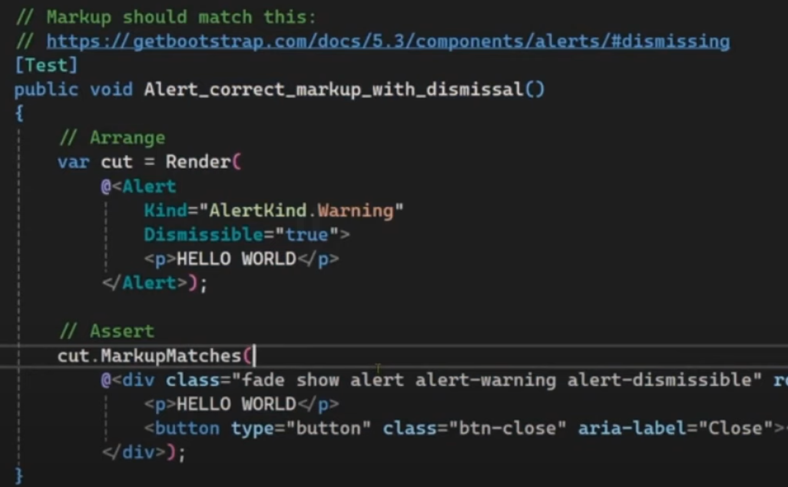
The markup does not need to be in the same order for the test to succeed. The test only verifies: Does the `div` apply the following markup.

### Custom elements
It is possible to register a Blazor component in ASP.NET which effectively exports the component to a component native in the web stack. This means that you could export the Blazor component and reference that exported component in HTML, JavaScript, WebForms, React, etc...
Using the dotnet-migration tool which creates a dotnet-core app with YARP configured, you could start migrating each page to Blazor components and reference them in the `aspx` file on the old app. This means the migration can go smoothly and migrate each component separately.

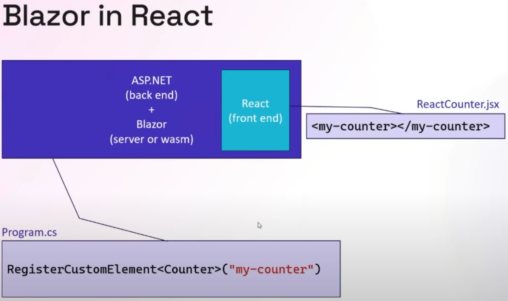
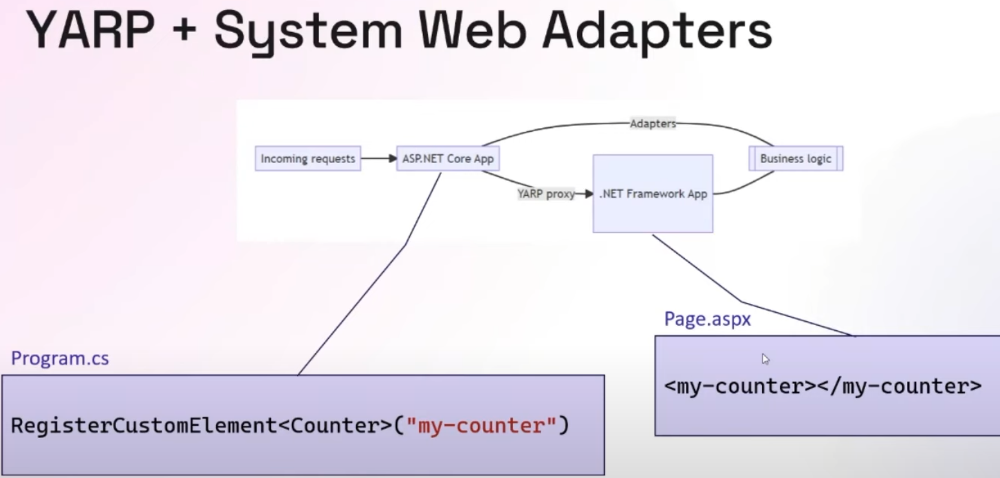
**Note**: The Blazor server needs to run so the frontend can reach that component.

#### Exporting javascript components as custom elements
Blazor can load components exported from the javascript side. This means you can mix match and create each component in the preferred language or stack and combine them all together inside Blazor.
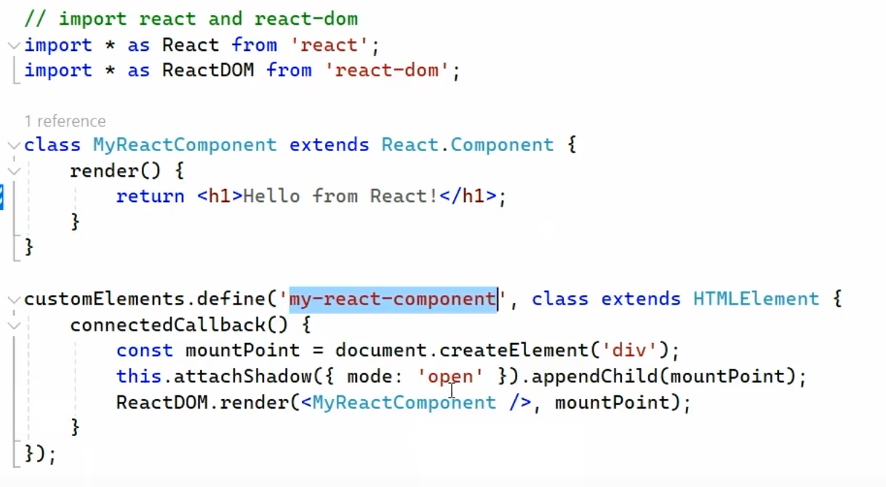
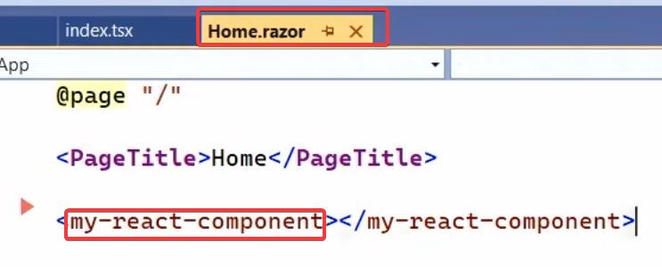

### JavaScript projects
Using the new JavaScript projects it is possible to create JavaScript based projects and package them as a `RazorClassLibrary` which can then be packed inside a nuget package, essentially creating JavaScript code but exposing it as Blazor code.
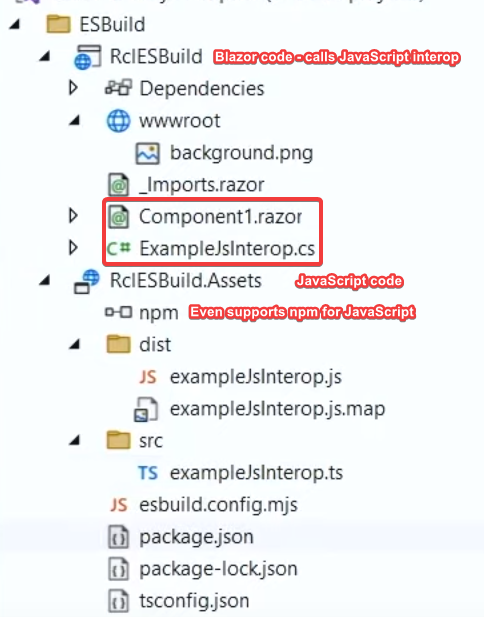

### Sources
* [Youtube video for interactivity between JavaScript and Blazor](https://www.youtube.com/watch?v=H1LlRUqj9U4&list=PLdo4fOcmZ0oULyHSPBx-tQzePOYlhvrAU&index=64)

# Containers
## Base image
The base image now **no** longer uses the `root user` to run the application.
This also means the base image now runs on port `8080` instead of `80`.

**Note**: It is still possible to run your commands (e.g. `interactive terminal (-it)`) as the `root user`. This way you can still execute the commands that require root access.


## Chiseled image
Chiseled images have been stripped of all features you would normally expect inside an linux based image (e.g. curl, touch, cat, apt-get / apt-update, etc...). This means that even if you run your command as the `root user`, the command will just not exist and will therefore fail. This is both good for security as it is for size of the image as it reduces the attack surface by having less possibilities.


### Size difference

Ignore the `sdk` size as this is only relevant for building the app, not running the app. Also, the `whoami` is wrong as it is no longer `root`, but `app` starting .NET 8 ([like mentioned above](#base-image)).

When the app is AOT compiled the size is even more reduced:


# .NET Aspire
Aspire.NET is an orchestrator which offers insights into other apps and provides an easy to use dashboard for looking into traces. The Aspire project is meant as a development tool and should therefore not be deployed to production itself.
.
The Aspire `AppHost` project can wire up other projects as dependencies which will create a private network in which each project can call each other under a name (like how this is done in `docker-compose`).

AppHost:


Client configuration:


## Deployment
The Aspire project is not meant to be deployed on it's own, however the Azure runtime has integrated knowledge about an Aspire project. Deploying the Aspire AppHost to Azure will run all the required dependencies via Azure `Container Apps`.

# Performance
## Asp.NET
### Request delegate generator (RDG)
Using request delegate generator will configure the app to use interceptors which will be generated at compile time via source generators to replace the **currently** only minimal api mappings like `MapPut`, `MapPost` with the optimized version which will improve the startup time for the application.


## Garbage collection
### Dynamically adapting to application sizes (DATAS)
DATAS is a new feature which enables the garbage collector to dynamically shrink the heap size depending on the load. Previously .NET always reserved a lot of memory when using the server garbage collection feature, this was in preparation to possible load it might receive. However when no such load comes it just has a lot of heap memory reserved doing nothing.

#### Source
[Medium blog explaining the details](https://maoni0.medium.com/dynamically-adapting-to-application-sizes-2d72fcb6f1ea)

## Dynamic profile guided optimizations (PGO)
On by default for .NET 8 🥳!
It will optimize it really quickly and only add the necessary instrumentation needed to keep track of the usage of the optimized code. This will allow the JITer to see patterns and optimize based on those patterns (if it considers it worthy to be optimized).

PGO can now also see and optimize based on happy flows for type hierarchy. It will look at the underlying type and if it is (almost) always the same type. It will then include the underlying type as the base call and only if it is not that type infer the actual type and call the method on that type. This reduces the need for type checking.

Setting `DOTNET_JitDisasmSummary=1` as environment variable (or by csproj config) will show the actual methods which are being compiled and when they are compiled. This also shows you the tier of which PGO the method is being compiled in.


Setting the `DOTNET_JitDisasm="[method name]"` where `[method name]` is replaced by the name of the method you want the assembly from will show you the compilation in assembly specific for the method you specified.

This also shows the tiered compilation so any recompilation will also be shown with the new assembly.


### Instrumentation overhead
Starting .NET 8 the instrumentation overhead has dropped significantly to the point where it is close to the non instrumented tier. This means that enabling the instrumentation is **no longer** a tradeoff between temporary performance drops for performance improvements later on (when the tier gets promoted).
This is a big improvement and means that PGO is close to being free!
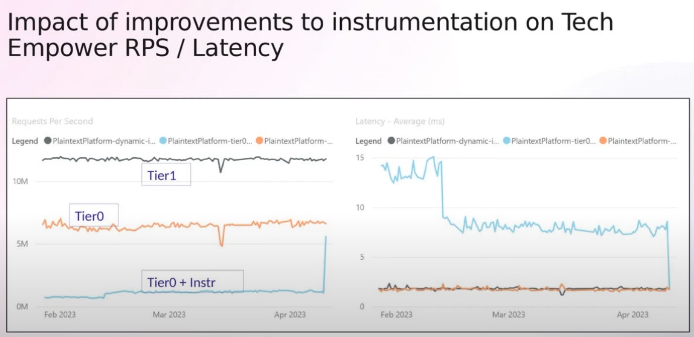

### Guarded devirtualization (GDV)
Instead of doing a virtual call to the interface/virtual method, the compiler will try to predict based on call information and will add code optimized for that specific instance of that virtual method or interface.
This is done based on call site testing, so if you have an instance of an class passed as an interface of that class it will always be the same instance even though it is passed as an interface. After seeing this, the compiler will devirtualize the code into code optimized for that specific type.
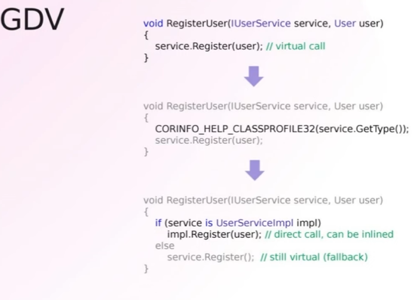
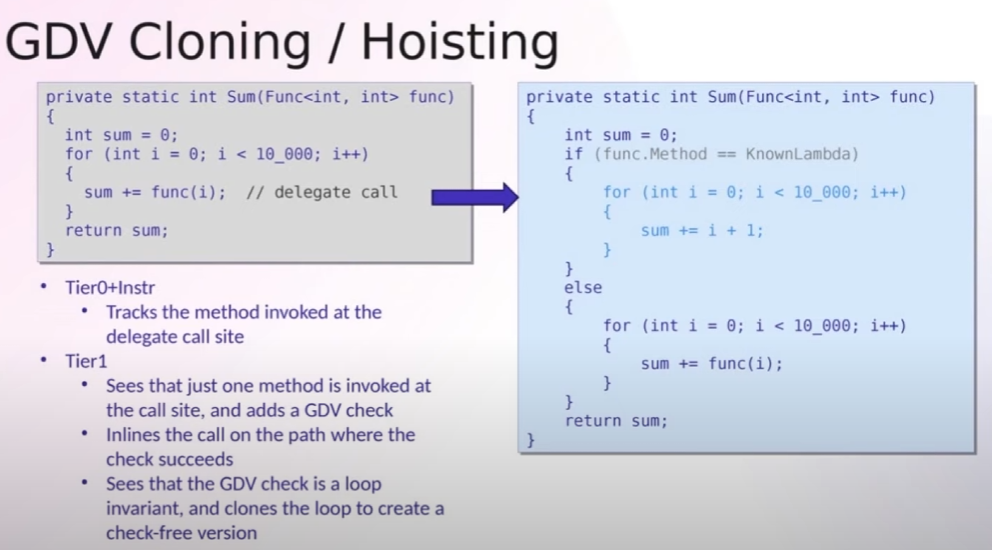

#### Ready to run (R2R) code PGO
Ready to run compiled code will now also be instrumented along side the already previously made optimization. The R2R code will have optimizations done at compile time, however these optimizations do not know how the application will be used at runtime, as such it cannot predict hot paths that should be optimized. 
Also, as it does not have the usage data, it does not know how to optimize the code.
Starting .NET 8 R2R code will have optimized code at compile time, but also support PGO which will based on the runtime data optimize it even further.
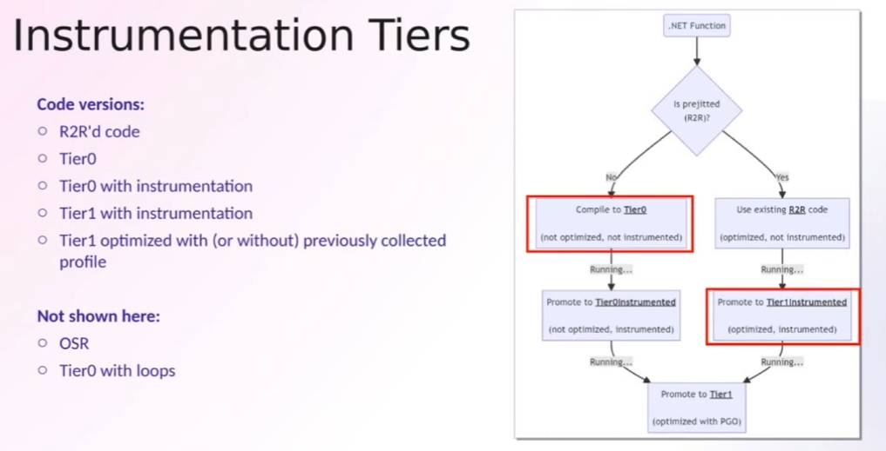
**Note**: The BCL have already been precompiled with R2R. This means that it will only have impact on your own code. Also, compiling your code as R2R will have impact on the physical size of your application as the size of an assembly can grow to between two or three times a larger.
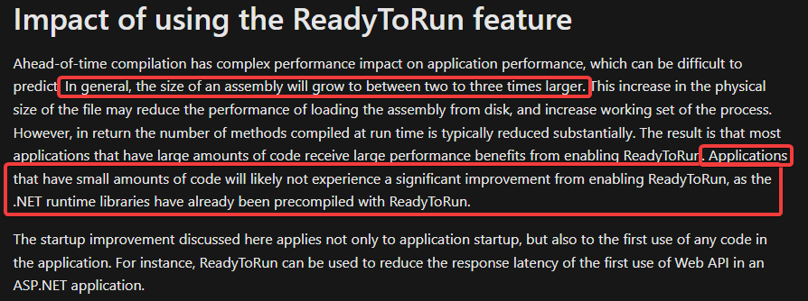

### Sources
- [Dynamic PGO youtube video](https://www.youtube.com/watch?v=WrpYcGic9b8&list=PLdo4fOcmZ0oULyHSPBx-tQzePOYlhvrAU&index=75)
- [ReadyToRun - MSDN ReadyToRun](https://learn.microsoft.com/en-us/dotnet/core/deploying/ready-to-run#impact-of-using-the-readytorun-feature)

## SearchValues
Searching multiple characters inside a string via the `IndexOf` is optimized for a low amount of characters (e.g. searching for `a` or `b`), but not for an `x` amount of characters. Creating a SearchValues object with all these characters that need to be searched for will be accepted in the `IndexOf` (or others like, `LastIndexOf`) overloads and allow the `IndexOf` code to choose the most optimal way for searching based on the size of the search.


# C# language
## Aliases
Now possible to specify he primitive type instead of the fully qualified namespace for a type. Example of this would be that you could now specify:
```csharp
using Grade = decimal; // Instead of `System.Decimal`
```

It is also possible to create an alias for a pointer:
```csharp
using unsafe Grade = decimal*;
```

And even specify a `ValueTuple` as an alias including the property names which was previously not possible:
```csharp
using Grade = (string Course, decimal Value); 
```

## Primary constructors
Primary constructors is a way to define parameters on a class which will be accessible inside that class. The primary constructor removes the boiler plate code needed in your class by defining a field for the dependencies and assigning them in the constructor. Instead you only define them at the class definition and reference them inside the class (as captured context).

It is even possible to pass along the parameters to the parent class you inherit from via calling that constructor in the hierarchy definition.

As all parameters inside the primary constructor are captured context they will be considered as normal parameters instead of a field reference. This means that you can do anything you would also be able to do on a parameter (e.g. setting the value). The C# design team is thinking about a readonly annotation, but for now this can only be done by creating a custom field inside the class. When assigning it the same name, the field will get priority when being called instead of the parameter (from the captured context).


All the parameters in the primary constructor are required, so any new constructor needs to eventually call the primary constructor for that type.

## Collection builders
Starting C# 12 collections can be initialized by simply specifying the items via `[]`. The `[]` will use the `Create` method specified on the type it needs to create. For certain types like `List<T>` the compiler has deep understanding of it and it will generate the code required, but for custom collections it requires an attribute called: `CollectionBuilder`.


Usage of this collection builder will look like the following:


### Spread operator
It is possible to join a collection inside the defined collection builder via the `..` (spread operator). The compiler will find the best way to join those collections together and create a flatmapped collection.


# Entity Framework
## Json columns
EF 8 supports all the LINQ queries on an JSON field even when that field which is stored has a nested property which is a collection. It is now possible to query even the nested collections via LINQ. Projections are also supported on nested JSON properties. This uses the `WITH` (for SQL Server) keyword to create a temporary table on which it projects the JSON properties that are being used.


## Array of primitives 
Most relational databases do not natively support array as a data type. This meant that having a collection of primitives would force you to have a work around (e.g. create a collections table and reference it).

Starting EF 8 it is now possible to map have this inside the same table. If the database does not support such type EF will create a JSON field and store the data in a JSON. As EF is responsible for this field it also has in depth knowledge of the type which is useful for retrieving it as it can easily parse to the correct type and do a query on it.


## Parameters stored in JSON values
Databases typically cache execution plans for queries so when the same query is executed again it will not have to create a new execution plan.
The cached execution plan can only be used if the query is identical (excluding the parameters). When doing an `IN` operation on a collection field EF 7 added the query parameters inside the SQL query. EF 8 however puts the parameters inside an JSON array and just references the parameter inside the query. This way the database uses the native JSON operators to unpack the parameters before executing the query, however as the query is the same the database can now use the execution plan cache again!

 

## MongoDB
There is a new MongoDB provider for EF!

# AI
## Semantic kernal
AI is generally hard to configure as there are a lot of steps involved with getting the data correctly (some simple steps required):
1. Generate chunks of text for as your input tokens
2. Get the embeddings for this text
3. Vectorize these embeddings and store them in a vector db
4. Get embeddings from the input text
5. Compare the embeddings vector in the database to get similarities.

Semantic kernel helps abstract these things away and provide you an API which does this for you. This API can then talk to the configured connectors behind the scenes (like Azure OpenAI). This simplifies the process.


# OpenTelemetry
## Logging
Instead of using the `ILogger.LogInformation` (or other `LogXxx` methods), you should use the `LoggerMessage` attribute which logs the correct statement for you without boxing the objects into an `object`. 


# Resilience
## Http client
Using the `Microsoft.Extensions.Http.Resilience` will allow setting resilience configuration for the `Http clients` based on the underlying Polly package.


It is also possible to set the default standards which is configured in the package, you can override these settings via the `Configure` method


When wanting to send the requests in parallel use `HedgingHandler`. Hedging will run the requests that are slow in parallel. **Note** this should only be used when the requests that are being send are idempotent.


The resilience handler also respects the `retry-after` header by default. This header is sent back by the server if the server has rate limiting configured (correctly). This can be turned off, if this is not the behavior that you want.


The package has support for OpenTelemetry and will trace or log data that is relevant.

# Json
## Object creation handling
System.Text.Json does by default ignore the deserialization of properties that are readonly.
However if that property has a default value assigned to it which can be mutated, it can instead of assign the property with a new value take that value and populate it with the data. This can be done via the `JsonObjectCreationHandling` attribute.

This attribute can also be moved to the source generator so this configuration is not tied to the object.


## Required property
The `required` keyword for properties is finally enforced 🥳!

## Unmapped json member handling
Using the `JsonUnmappedMemberHandling` attribute it is possible to specify the behavior requested for the deserialization around unmapped json members.
This means you can enforce the contract to be the same as the input and not accept unwanted properties.


## Interface hierarchy
Base hierarchy types will now be included in the serialization of an interface.


# Pattern matching
## Switch expression
**Note** the features below here were already available since `C# 9`, but unknown to me hence I wrote them down.

When using a switch expression it is possible to capture the default value in a variable via capturing it as `var [variable name]` instead of discarding it via `_`. 
**Note**: When capturing the default value as a variable in a switch expression the variable will always be nullable as the switch expression pattern matching also checks if the type is not `null`. This means that when it is `null` but of that type it will still go to the default clause which is the variable defined. Because of this, this variable is always nullable and should be used with nullability in mind.


Also, when having a condition on a sub property which is nullable it will automatically check the nullability for you and not throw an exception.


# Runtime
## Native AOT (ahead of time) vs JIT (just in time) compilation
### Advantages of AOT
Compiling to AOT has multiple advantages over JIT:

Explanation of the advantages over JIT:

#### Smaller apps
Compiling to the specific platform reduces the need of having code for all possible platforms and decide at runtime which code should be used.
Also, as there is no runtime anymore the compiler does not include the JIT code.
**Note**: Compiling a method AOT can also result in more code generated as it requires every possible outcome to be compiled compared to JIT which will decide what code should be used at runtime. This is complimented by the aggressive trimming process after it has compiled, this process will remove all code which will in theory never be used.
Trimming itself also has downsides so take these downsides in mind before choosing.


#### Faster startup
As the app trims away all unnecessary code, it will require less startup time. Also, when running a JIT application the JITTer needs to startup on it's own before it can actually start the application.
Lastly because the code is already compiled to the platform it will run on it will simply start the code instead of first having to figure out how the application should start.

#### Less memory use
The JITTer reserves more memory for the application to easily expand, as well as the JITTer also being a process that is running which requires memory on its own.
This combined results in more memory usage than is required for the application.

### How does AOT work


### Impact of **not** having a JIT

As the name suggests the JITTer will compile the code `just in time` this means that it can perform code optimizations and dynamic code generation.
As well as `Reflection`.

### Other considerations


### Conclusion
It is a tradeoff. When running short-lived applications that will start a lot to do a quick task before shutting down, it might be worthwhile to compile to AOT.
However when you have code which continuously runs and has a lot of throughput it might be better to compile it to JIT as it can perform code optimizations (or tiered compilation (Dynamic PGO)) on hot paths. Also, when you need to use features such as `Reflection.Emit` you would have to go with JIT either way.
**Note**: `Expression.Compile` will work in AOT, but it will have reduced performance 

# IOT
Using the .NET nanoFramework it is possible to run a limited version of C# on a list of supported microcontrollers!
* Espressif esp32 (xtensa)
* Arduino

## Sources
* [Youtube video](https://www.youtube.com/watch?v=zwkspYxtFAE&list=PLdo4fOcmZ0oULyHSPBx-tQzePOYlhvrAU&index=60)
  * Full chain from a microcontroller receiving a message, sending it to the raspberry pi for processing.
* [Sample project](https://github.com/burkenyo/burkenyo.iot)
* [MSDN IOT](https://dotnet.microsoft.com/en-us/apps/iot)


# Development tunnels
Hot reload is now possible for dev tunnels 🥳! This means that you don't need to redeploy your dev tunnel app each time you make changes to it.

# .NET MAUI
Using the new experimental `HybridWebView` it is possible to render static web assets (HTML, JS, CSS, etc) inside MAUI. This means you can cross develop on an app even in different languages and just add them to MAUI!


# NuGet
## Auditing
NuGet now audits packages for vulnerabilities. If a package has a vulnerability it will notify the developer that a package has a vulnerability inside it. It even shows the severity the vulnerability and how to remediate this vulnerability.
The report is also shown when restoring (or adding/removing) the packages via the cli.


### Custom vulnerability
Via the new vulnerability api it is possible to manually provide vulnerability information on your package. This means that any NuGet source will be able to show this information.


## Conditional package updating
From NuGet 6.8 it is possible to conditionally set the version of the package that your application relies on.
This means you have an application which targets multiple frameworks as well as have matching package targeting for each framework version.
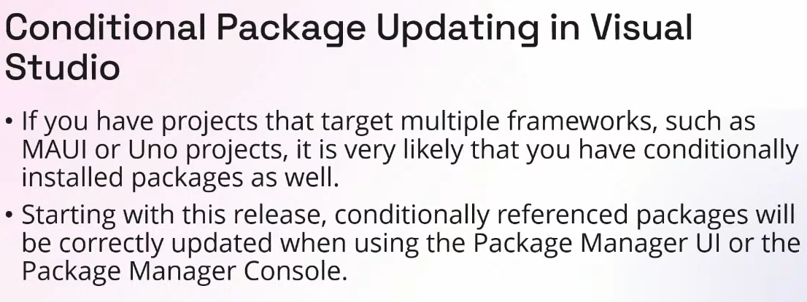

## Package source mapping
Package source mapping allows the package to be mapped to a specific source. This means that even if a package with the same name exists on another source it will not trust that package and retrieve the package from the correct source.
This is useful for security reasons as this prevents the possibility of an malicious user uploading a package with the same name as the package your application depends on while having included malicious code. Without this feature it is possible that the wrong source would be used. Only happens if another source was configured that also has this package e.g. the application has 2 sources configured:
1. A public source for public packages
2. A private source for internal packages


### Automatically configure the source mapping


### Disallow transitive source packages from different source
The global package folder now checks to see if the dependency of a package has previously already been installed (is it in the cache) and if it has been installed, if the cached variant is from the configured source. If not it will disallow that package.
 

# Clean architecture
Using the `clean-arch` template you can start working on a clean architecture code sample.

## Todo
Verify with colleagues if this is valid or not.

## Source
[Youtube video](https://www.youtube.com/watch?v=yF9SwL0p0Y0&list=PLdo4fOcmZ0oULyHSPBx-tQzePOYlhvrAU&index=68)

# Skipping missing sessions
Sessions inside the `Premier Bonus` section as well as sessions that ran after [Clean Architecture with ASP.NET Core 8](https://www.youtube.com/watch?v=yF9SwL0p0Y0&list=PLdo4fOcmZ0oULyHSPBx-tQzePOYlhvrAU&index=69) session will be skipped.
The reason for this is because I have evaluated them to have little additional value over the already viewed sessions. This in the combination with the fact that watch each session back takes a considerable amount of time I have chosen to no longer watch them back.
